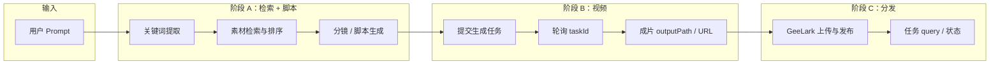

# 从 Cursor 到扣子（Coze）Workflow：QAS 迁移执行指南

**目的**：按「迁移建议」五步，把当前在 **Cursor + Skills** 里跑通的 Quality at Scale 流水线，映射到 **扣子 Workflow** 的可搭建结构，便于你在控制台里拖拽节点落地。

**前提**：图片中的步骤 2～5 需在 **扣子** 网页里操作；本仓库文档负责 **步骤 1（数据流梳理）** 与 **步骤 3～5 的对照表/清单**，减少返工。

---

## 步骤 1：先梳理现有流程（数据流）

### 1.1 业务主链路（与 `docs/QAS-pipeline-status.md` 一致）

```
用户意图（自然语言 Prompt）
    → 素材检索（Drive / 本地库 / 关键词）
    → 结构化脚本（分镜、Seedance 格式、@素材）
    → 视频生成（Seedance / 即梦，轮询 task → 成片）
    → 分发（GeeLark → TikTok / INS / YouTube / Facebook）
    → 结束（成片路径、发布任务 ID、状态）
```

### 1.2 Cursor 侧「逻辑模块」数据流（便于画白板）



### 1.3 Skills 调用链（Cursor 对话中的「软编排」）

```
video-create-distribute（统一入口）
    ├─ video-pipeline（生成）
    │     ├─ video-director → storyboard-studio（prompt / 分镜规范）
    │     └─ run.js 等（Seedance 自动化）
    └─ geelark-publish（分发）
          └─ publish.js（GeeLark API）
```

**迁移含义**：在扣子里，上述「软编排」要变成 **显式节点**：每个 Skill 对应一类 **LLM 节点**、**HTTP 节点** 或 **插件/代码节点**。

---

## 步骤 2：创建主工作流（扣子侧骨架）

在扣子新建 **空 Workflow**，建议先搭 **与上图同序** 的节点骨架（名称可自定，便于团队对齐）：

| 顺序 | 建议节点名（示例） | 作用 |
|------|-------------------|------|
| 1 | `Start` / 工作流入参 | 接收 `user_prompt`, `options`（时长、平台等） |
| 2 | `ExtractKeywords` | 从 Prompt 抽关键词 |
| 3 | `SearchMaterials` | 调 Drive/素材 API 或检索逻辑 |
| 4 | `GenerateStoryboard` | LLM：输出结构化分镜 + Seedance 文案 |
| 5 | `UserConfirm`（可选） | 人机确认分镜 / 选 A-B-C，对应 video-pipeline 的确认门 |
| 6 | `SubmitVideoJob` | HTTP：提交 Seedance/后端生成任务 |
| 7 | `PollVideoStatus` | 循环或延时节点：直到成功或失败 |
| 8 | `PublishToSocial` | HTTP：GeeLark 或你们封装后的发布 API |
| 9 | `QueryPublishTask` | 查询发布任务状态 |
| 10 | `End` | 返回成片 URL、发布任务 ID、错误信息 |

先 **只连箭头、不接细节**，与流程图一致即可。

---

## 步骤 3：逐个迁移功能（Cursor 模块 → 扣子节点）

| Cursor / 仓库中的能力 | 建议扣子节点类型 | 说明 |
|----------------------|------------------|------|
| `video-director` + `storyboard-studio` | **大模型节点** + Prompt 模板 | 分镜与安全红线可做成系统提示词片段 |
| `video-pipeline` 关键词 + 文件搜索 | **代码节点** 或 **HTTP** 调你们 `h5-video-tool-api` | 若在扣子里无法读本地盘，需 API 化素材检索 |
| Seedance `run.js` / 未来 `POST /api/video/generate` | **HTTP 请求节点** | 入参：分镜 JSON + 素材 URL；出参：`taskId` |
| 轮询成片 | **循环 + 条件分支** 或 **单独轮询子工作流** | 对齐 `latest.json` 或 API 返回字段 |
| `geelark-publish` | **HTTP 节点** | 与 `publish.js` 相同 API 契约 |
| `query-tasks` / 状态查询 | **HTTP 节点** | 发布结果验证 |
| Cursor 里「用户选 A/B/C」 | **对话节点** 或 **表单/变量** + 分支 | 复现 video-pipeline 的确认门 |

**H5 缺口提醒**（见 `QAS-pipeline-status.md`）：分镜 API、视频生成 API、发布 API 未齐时，扣子侧 HTTP 节点应对 **同一套后端契约** 开发，避免两套逻辑。

---

## 步骤 4：对齐输入输出（节点间数据类型）

建议在扣子 **工作流全局变量** 中统一下列字段（名称可与下表一致，便于联调）：

| 阶段 | 建议字段 | 类型 | 说明 |
|------|-----------|------|------|
| 入参 | `user_prompt` | string | 用户原始描述 |
| 入参 | `target_platforms` | string[] | 如 `["tiktok"]` |
| 关键词 | `keywords` | string[] | 供检索用 |
| 素材 | `materials` | `{ id, url, name }[]` | URL 优先，便于云侧访问 |
| 脚本 | `storyboard` | object / JSON | 分镜列表、每镜 prompt、时长 |
| 视频任务 | `video_task_id` | string | Seedance 侧 task |
| 视频结果 | `video_url` / `local_path` | string | 云端联调用 URL |
| 发布 | `publish_task_ids` | string[] | GeeLark 返回 |
| 错误 | `last_error` | string | 任一步失败时写入，便于 End 节点返回 |

**检查项**：每个 HTTP 节点的 **请求体 JSON** 与 **响应 JSON** 在扣子里用「示例跑通」测一遍；与现有 `publish.js`、未来 `api/video/generate` 的字段名保持一致。

---

## 步骤 5：联调测试（完整用户故事）

用 **一条故事** 贯穿全流程，避免只测「单个节点能调通」：

| # | 用户故事 | 期望结果 |
|---|-----------|----------|
| US1 | 用户输入：「生成 10 秒浪人打怪物风格视频，并发到 TikTok」 | 经过关键词 → 素材 → 分镜 → 成片 → 发布，End 返回可访问成片链接与发布任务 ID（或明确失败原因） |
| US2 | 仅生成、不发布 | 工作流在 `PublishToSocial` 前结束，`video_url` 非空 |
| US3 | 素材不足 | `SearchMaterials` 返回空列表时，分支到提示用户补充素材，不提交无效视频任务 |
| US4 | 发布失败（未登录云手机） | `QueryPublishTask` 或错误码分支返回可读错误，与文档中「账号前置检查」一致 |

每条故事至少跑 **一次成功路径 + 一次失败路径**（如网络超时、任务失败）。

---

## 与仓库文档的交叉引用

| 文档 | 用途 |
|------|------|
| `docs/QAS-pipeline-status.md` | Pipeline 阶段、卡点、H5 缺口 |
| `docs/QAS-skills-and-workflow.md` | Skills 清单与调用关系 |
| `docs/plans/2025-03-11-h5-implementation-plan.md` | API 落地顺序，可与扣子 HTTP 节点同步规划 |

---

## 你在扣子控制台上的操作清单（对照图片）

1. **步骤 1**：用本文「步骤 1」在白板或飞书文档画一版数据流（可直接贴 mermaid）。
2. **步骤 2**：新建 Workflow，按「步骤 2」表拖拽空节点并连线。
3. **步骤 3**：按「步骤 3」表逐个节点填实现（先通主路径）。
4. **步骤 4**：按「步骤 4」统一变量与 API JSON，每两个相邻节点做一次字段对照。
5. **步骤 5**：按「步骤 5」用户故事联调，记录失败样例与分支补充。

完成以上五步，即与图片中的迁移建议一致；若你希望下一步把 **某个 HTTP 契约** 写成 OpenAPI 片段或扣子可复制 JSON 示例，可以指定节点名称继续细化。
