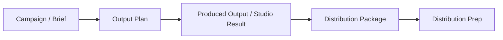

# Data Contract Hardening

> Date: 2026-05-11
> Run: `2026-05-11-data-contract-hardening`
> Source: Run 9 from `2026-05-10-gobs-next-optimization-checklist.md`

## Purpose

Run 9 makes the Run 0 five-entity relationship visible in the main Campaign chain without redesigning storage:

- Campaign creates an Output Plan with stable `campaignId` and `briefId`.
- Produced outputs carry `campaignId`, `briefId`, and parent output/item lineage.
- Packages created from produced outputs keep `outputPlanId`, `productionItemId`, `outputIds`, and source asset IDs.
- Studio writeback updates both Output Plan and Package lineage.
- Campaign Output and Distribution surfaces show compact link-health status.

## Main Chain

## Implementation Boundaries

- No historical data migration. Legacy records may show link-health warnings.
- No new global state store.
- No direct GeeLark publish API attribution changes in this run.
- No provider-service or generation-model changes.

## Acceptance Mapping

| Acceptance | Implementation note |
|---|---|
| Output traces to Campaign | Output Plan creation receives `campaignId`; produced outputs inherit `campaignId` and `briefId`. |
| Package traces related outputs | Package `source` stores `outputPlanId`, `productionItemId`, `outputIds`, and `sourceAssetIds`. |
| Refresh/cross-page keeps context | Studio URL carries IDs and can rebuild handoff from backend Output Plan. |
| Broken chains are visible | Shared link-health helper feeds Campaign Output and pending Package UI. |
