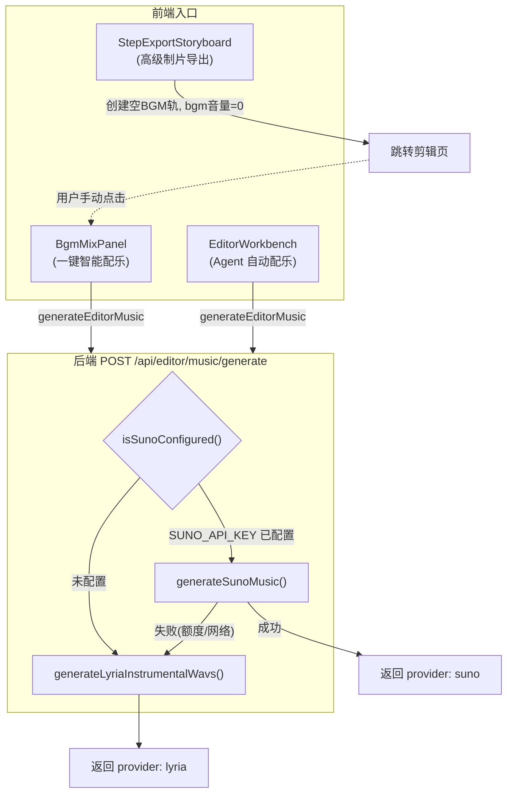
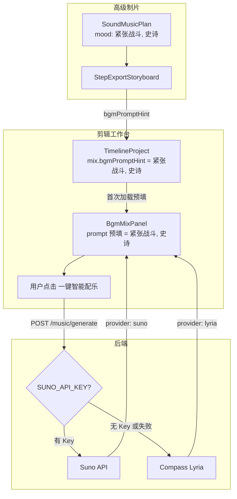

# 配乐逻辑修复与增强方案

> 日期：2026-04-15  
> 范围：视频混剪配乐 + 高级制片成片配乐  
> 状态：待实施

---

## 一、现状问题诊断

### 1.1 架构全貌



### 1.2 三个核心问题

| # | 问题 | 根因 | 影响 |
|---|------|------|------|
| 1 | Suno 从未被调用 | 服务器 `.env` 缺少 `SUNO_API_KEY`，`isSunoConfigured()` 返回 `false`，永远走 Lyria | 配乐质量受限于 Lyria（32.8s/段 WAV） |
| 2 | Agent 自动配乐日志硬编码 "Lyria" | `EditorWorkbench.tsx:297` 写死文案，不读取返回的 `provider` | 用户看到的引擎信息与实际不符 |
| 3 | 高级制片导出无自动配乐 | `StepExportStoryboardOverview` 创建空 BGM 轨 + bgm 音量=0，`SoundMusicPlan` 完全未利用 | 制片阶段的音乐规划（mood/segment/bpm）被浪费，用户需手动重新输入 |

---

## 二、修复方案（3 个改动点）

### 改动 1：配置 SUNO_API_KEY 到服务器

**操作**：在服务器 `/home/ubuntu/qas-h5/` 的 `.env` 中添加 `SUNO_API_KEY`，然后 `pm2 restart qas-api`。

**验证**：调用一键配乐后，检查返回的 `provider` 字段是否为 `suno`；前端 BgmMixPanel 的引擎 badge 应显示紫色 "Suno"。

**说明**：后端路由 `editorMusic.ts` 的 Suno 优先 + Lyria fallback 逻辑本身没问题，不需要改代码：

```typescript
// h5-video-tool-api/src/routes/editorMusic.ts 第 99-144 行
if (isSunoConfigured()) {
  try {
    const tracks = await generateSunoMusic({ ... });
    // 成功 → 返回 provider: 'suno'
    return;
  } catch (err) {
    if (err instanceof SunoSensitiveWordError) {
      // 敏感词 → 直接报错，不 fallback
      return;
    }
    // 其他错误 → fallback 到 Lyria
  }
} else {
  console.log('[editorMusic] SUNO_API_KEY 未配置，直接使用 Lyria');
}
// Lyria fallback...
```

### 改动 2：修复 EditorWorkbench 中 Agent 自动配乐的日志

**文件**：`h5-video-tool/src/pages/EditorWorkbench.tsx`

**修改 `runAutoBgmFromAgentMessage` 函数**：

```typescript
// === 修改前 ===
pushLog('进度：检测到配乐需求，正在润色并生成 BGM（Lyria）…');
// ...
generateEditorMusic({ prompt: out.prompt, negativePrompt: out.negativePrompt || undefined, sampleCount: 1 }),
160_000,
'Lyria 生成超时（160s）',
// ...
pushLog('已根据对话自动完成配乐；不满意可在左下「配乐生成」微调后再点「生成」。');

// === 修改后 ===
pushLog('进度：检测到配乐需求，正在润色并生成 BGM…');
// ...
generateEditorMusic({ prompt: out.prompt, negativePrompt: out.negativePrompt || undefined, sampleCount: 1 }),
160_000,
'配乐生成超时（160s）',
// ...
const providerName = res.provider === 'suno' ? 'Suno' : 'Lyria';
pushLog(`已根据对话自动完成配乐（引擎：${providerName}）；不满意可在左下「配乐生成」微调后再点「生成」。`);
```

### 改动 3：高级制片导出时预填 BGM prompt

分两步实施：

#### 3a. 类型扩展 + 导出时提取 SoundMusicPlan

**文件 1**：`h5-video-tool/src/editor/types/timeline.ts`

在 `TimelineMix` 接口中新增可选字段：

```typescript
export interface TimelineMix {
  sourceAudio: number;
  bgm: number;
  bgmFadeOut?: number;
  bgmFadeIn?: number;
  bgmPromptHint?: string;  // 新增：来自高级制片 SoundMusicPlan 的配乐风格提示
}
```

**文件 2**：`h5-video-tool/src/studio/steps/StepExportStoryboardOverview.tsx`

导出创建 TimelineProject 时，从当前制片项目的 `ProductionDesignLayer.soundMusic` 中提取 mood 信息：

```typescript
// 从 SoundMusicPlan 提取 mood 关键词作为配乐提示
const musicMoods = designLayer?.soundMusic?.music
  ?.map(m => m.mood)
  .filter(Boolean)
  .join(', ');

let project: TimelineProject = {
  id: `proj_prod_${Date.now()}`,
  fps: 30,
  durationSec: cursor,
  aspectRatio: ar,
  mix: {
    sourceAudio: 1,
    bgm: 0,
    bgmFadeOut: 2,
    bgmFadeIn: 1,
    bgmPromptHint: musicMoods || undefined,  // 新增
  },
  tracks,
};
```

#### 3b. BgmMixPanel 读取 hint 并预填

**文件**：`h5-video-tool/src/editor/components/BgmMixPanel.tsx`

在组件首次挂载时，如果 `project.mix?.bgmPromptHint` 有值且当前 prompt 为空，自动填入：

```typescript
// 首次加载时，从制片规划预填 prompt
useEffect(() => {
  const hint = project.mix?.bgmPromptHint;
  if (hint && !prompt) {
    setPrompt(hint);
  }
}, []);  // 仅首次挂载
```

同时在 prompt 输入框附近显示来源提示（可选，提升 UX）：

```tsx
{project.mix?.bgmPromptHint && prompt === project.mix.bgmPromptHint && (
  <span className="text-[9px] text-[var(--color-text-muted)] italic">
    来自制片音乐规划
  </span>
)}
```

---

## 三、改动后的数据流



---

## 四、涉及文件清单

| 文件 | 改动类型 | 说明 |
|------|----------|------|
| 服务器 `.env` | 配置 | 添加 `SUNO_API_KEY` |
| `h5-video-tool/src/pages/EditorWorkbench.tsx` | 修改 | 修复日志硬编码，动态读取 provider |
| `h5-video-tool/src/editor/types/timeline.ts` | 修改 | `TimelineMix` 新增 `bgmPromptHint` 字段 |
| `h5-video-tool/src/studio/steps/StepExportStoryboardOverview.tsx` | 修改 | 导出时从 SoundMusicPlan 提取 mood 填入 hint |
| `h5-video-tool/src/editor/components/BgmMixPanel.tsx` | 修改 | 首次加载时读取 hint 预填 prompt |

**不需要改动的文件**（逻辑已正确）：
- `h5-video-tool-api/src/routes/editorMusic.ts` — Suno 优先 + Lyria fallback 逻辑正确
- `h5-video-tool-api/src/services/sunoMusic.ts` — Suno 调用逻辑正确
- `h5-video-tool-api/src/services/compassLyriaMusic.ts` — Lyria 调用逻辑正确

---

## 五、实施顺序

1. **改动 1**：配置 SUNO_API_KEY → pm2 restart → 验证一键配乐返回 `provider: suno`
2. **改动 2**：修复 EditorWorkbench 日志（小改动，风险低）
3. **改动 3a**：类型扩展 + 导出提取（需要确认 `designLayer` 在导出上下文中可获取）
4. **改动 3b**：BgmMixPanel 预填逻辑
5. **编译验证**：`npx tsc --noEmit` 通过
6. **部署五步流程**
